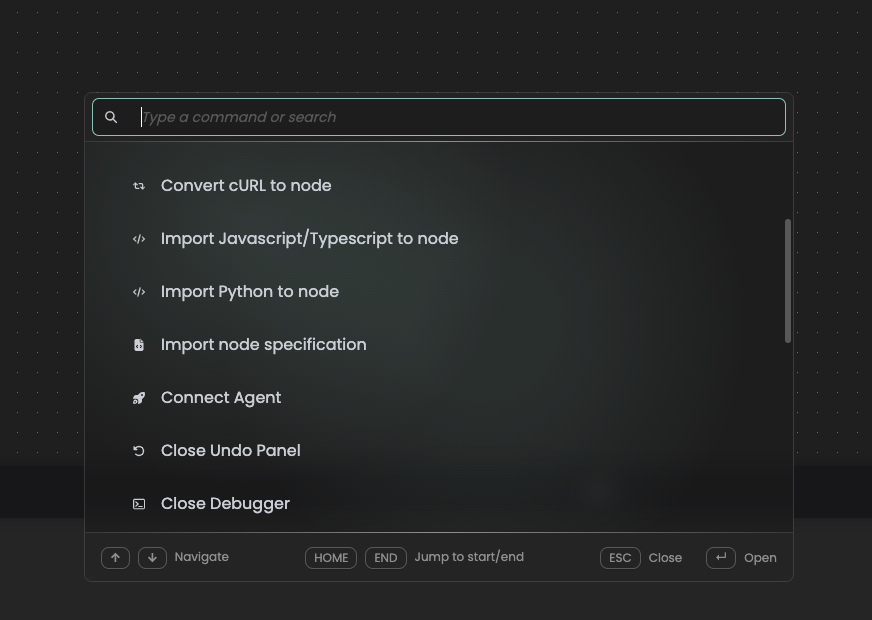

# Vulcano wave nodes

helmut.cloud wave node catalog for **Vulcano**, MoovIT's broadcast graphics system. Eight nodes that create graphics from templates, move them into projects, and get the rendered files back out — usable as building blocks in Stream Designer.

| Node | Category | What it does |
|---|---|---|
| List templates | Templates | Lists the assets in a template folder, subfolders included |
| Create graphic | Assets | Renders a new graphic from a template, filling in the property values you supply |
| Download highres file | Assets | Streams an asset's high resolution file onto the agent's disk |
| Download proxy file | Assets | Streams an asset's proxy file onto the agent's disk |
| Upload mogrt | Assets | Uploads a Motion Graphics template into a folder of the template tree |
| Create ograf link | Assets | Creates a shareable browser link to an asset's OGraf graphic |
| Add assets to project | Projects | Adds existing assets to a project |
| Create vgg project | Projects | Uploads a video and creates a Video Graphic Generator project from it |

A typical stream chains them: **List templates → Create graphic → Add assets to project → Download highres file.**

## Authentication

Every node takes a `Vulcano url` and an `Api token`. The token is the service token generated in the Vulcano user interface (it starts with `vt_`) and is sent as `Authorization: Bearer <token>`. Wire it from an upstream *Get space secret* node in production; a literal value works for testing. Vulcano rejects service tokens passed as a query parameter, so the header is the only supported form.

## Development

    npm install
    npm test        # unit tests for the pure helpers
    npm run lint
    npm run bundle  # produces bundle.js for import into Stream Designer

Nodes share `lib/helpers/vulcano-client.ts` for request building, curl redaction, error translation, multipart uploads and streamed downloads. Every node has a `.md` wavedoc sidecar next to it describing its inputs, outputs and failure causes.

Request shapes are grounded in the Vulcano server's own OpenAPI specification and its Java delegates, not in generated documentation.

---

# helmut.cloud catalog

This repository serves as a base for creating new node catalogs to be used in helmut.cloud stream designs.

## Constructing your catalog

### Catalog

Your catalog is defined using the Catalog constructor. The index.ts file should have a Catalog instance has its default export to allow the build scripts to function properly.

A Catalog consists of a name, description, logo, minimum required engine version and a series of nodes. Nodes are any class that extends the Node class.

#### Minimum required engine version

Any space using an older engine version than the one specified will not be able to execute streams with nodes from this catalog.

We intend to have a compatibility testing tool in the future, to easily check if there are incompatabilities between the catalog's nodes and any engine version.

### Node

Any class that extends the Node class is required to define its specification and its execution logic. Any packages can be used here as they will all be bundled with the source code when publishing.

## Testing your nodes

To test your nodes it is necessary to have a [helmut.cloud Agent](https://app.helmut.cloud/account/user/downloads) running locally. You should then go to [this URL](http://localhost:6968/api/agent/v1/modules/dev-wave/) and submit the root directory of this repository. Alternatively you can use the `link` command to do the same.

    npm run link

After that you will need to paste the node specification into the Stream Designer Studio. Press `cmd+k` which will cause a dialog to popup where you need to find `Import node specification`.



The specification can be obtained by using the `spec` script and copying the JSON written to standard out. The `--silent` argument is important to prevent npm from writing to stdout if you want to pipe or redirect the command output.

    npm run --silent spec -- <name of your node>

### Debugging

To be able to step through the code of your nodes you will need to start up the agent via the `debug` script.

    npm run debug

This will launch a NodeJS process with the [--inspect flag](https://nodejs.org/en/learn/getting-started/debugging).

Any debug client can be used to attach to this NodeJS process, but the easiest way is to start it inside a [Javascript Debug Terminal in VSCode](https://code.visualstudio.com/docs/nodejs/nodejs-debugging#_javascript-debug-terminal). After starting the agent, it is still necessary to run the `link` script in another terminal to be able to debug your own nodes.

To keep iterating on your catalog with debug capabilities, use the `bundle:debug` script instead of the regular `bundle` script.

    npm run bundle:debug

In the future this process will become more streamlined as we improve the external catalog development experience.

## Publishing your catalog

Publishing happens automatically whenever a tag matching `v*` is pushed. [publish-catalog.yaml](./.github/workflows/publish-catalog.yaml) bundles the catalog and commits it to the `gh-pages` branch, which GitHub Pages serves. No bucket, no credentials and no repository secrets are involved.

To cut a release, add the entry to `changelog.json` first — `scripts/check-changelog.mjs` fails the build unless the newest entry's version matches the tag — then tag:

    npm version minor        # keeps package.json in step, must match changelog.json[0].version
    git push --follow-tags

A published version is immutable: the workflow refuses to overwrite a version folder that already exists, so a broken release is fixed by publishing the next version, never by re-tagging.

The published site keeps every release side by side (it has no landing page — browse the files directly):

    https://moovit-sp-gmbh.github.io/vulcano-wave-nodes/
    ├── index.json                  # the registry Stream Designer reads
    ├── changelog.json
    └── <version>/
        ├── bundle.js               # what the Agent downloads
        ├── specification.json
        ├── catalog-info.yaml
        └── docs/*.md               # the wavedocs

Add the catalog to a space once via Stream Designer → **Manage node catalogs** → **Add external catalog**, pasting:

    https://moovit-sp-gmbh.github.io/vulcano-wave-nodes/index.json

Later releases show up in that same dialog; a space admin picks the new version per space. Nothing updates by itself, and streams keep the catalog version they were built with.

## Staying in sync

We recommend adding this repo as a remote so that you can make sure your catalog is up-to-date.

    git remote add blueprint https://github.com/moovit-sp-gmbh/wave-nodes-catalog-blueprint.git
    git fetch blueprint
    git rebase blueprint/main // You can also choose to merge instead of rebase

As long as you make no changes to the `Node` and `Catalog` classes merge/rebase conflicts should be minimal. Should you need to extend these classes in anyway we recommend creating new classes that extend them to avoid future conflicts. The `index.ts` file can export an instance of any class that extends `Catalog`.

# Development of Nodes

Each node should extend the abstract class Node.
The **specification** field and the **execute()** method are mandatory for implementation.
Additionally, this class contains a **wave** field that will be inserted at runtime and whose methods can be used to access and control the execution behavior of the current node.
This class should be exportable by default to be available for use from outside:

```typescript
export default class SomeAction extends Node {
    wave!: Wave; // This property will be inserted at runtime don't implement it
    specification: StreamNodeSpecificationV2 = { ... };
    execute(): Promise<void> { ... };
}
```

## Specification

The specification defines the basic metadata required to publish a node in the catalog.
Also, the input data that the node expects and the expected results that will be placed in the outputs should be described here.
For more details, you can view the components of the specification in the SDK:

```typescript
import { StreamNodeSpecificationV2 } from "hcloud-sdk/lib/interfaces/high5";
```

### Version of the specification

At this moment, version 2 of the node specification is relevant.
To specify this - please use the **specVersion** field:

```typescript
specification: StreamNodeSpecificationV2 = {
    specVersion: 2;
    ...
}
```

### Name

In order to specify a name for the node - please use the **name** field.
This name will be used in the Stream Designer Studio and on other pages of the helmut.cloud:

```typescript
specification: StreamNodeSpecificationV2 = {
    name: "Prime numbers";
    ...
}
```

### Description

A more detailed description of the function performed by the current node should be placed in the **description** text field:

```typescript
specification: StreamNodeSpecificationV2 = {
    ...
    description: "Calculates a series of prime numbers up to the given position and returns the last value in this series";
    ...
}
```

### Node category

Please specify the **category** to which the current node will belong to:

```typescript
specification: StreamNodeSpecificationV2 = {
    ...
    category: "Math operations";
    ...
}
```

### Node version

The node version must be set according to the defined **StreamSemanticVersion** type.
This type includes the following fields:
- major - changes effecting the user and are not backwards compatible (parameter changes);
- minor - changes effecting the user but are backwards compatible (logic changes);
- patch - changes not effecting the user (bug fixes);
- changelog - array with descriptions for every change on the the node.

```typescript
import { StreamSemanticVersion } from "hcloud-sdk/lib/interfaces/high5";

specification: StreamNodeSpecificationV2 = {
    ...
    version: {
        major: 1,
        minor: 0,
        patch: 2,
        changelog: ["fixed a bug in the definition of prime numbers", "optimized the calculation algorithm"]
    } as StreamSemanticVersion;
    ...
}
```

### Author details

Information about the author must be specified according to the **StreamNodeSpecificationAuthor** type.
This type includes the following fields:
- name
- company
- email

```typescript
import { StreamNodeSpecificationAuthor } from "hcloud-sdk/lib/interfaces/high5";

specification: StreamNodeSpecificationV2 = {
    ...
    author: {
        name: "John Smith",
        company: "Acme Corp",
        email: "john.smith@acmecorp.com"
    } as StreamNodeSpecificationAuthor;
    ...
}
```

### Tags

You can specify an array of tags that must contain one of the listed values (this is an optional field of the specification):
- PREVIEW,
- EXPERIMENTAL.

```typescript
import { StreamNodeSpecificationTag } from "hcloud-sdk/lib/interfaces/high5";

specification: StreamNodeSpecificationV2 = {
    ...
    tag: [StreamNodeSpecificationTag.PREVIEW];
    ...
}
```

### Expected input data

The specification should describe in detail all the input data that are necessary for the operation of the node.
The description of each input parameter is an array element contained in the **inputs** field.
The input parameter details must match the **StreamNodeSpecificationInput** type which defined in the SDK:

```typescript
import { StreamNodeSpecificationInput } from "hcloud-sdk/lib/interfaces/high5";
```

#### Name of the input parameter

Each input parameter must have a name. This name will be used to access the value of the specified parameter.
It is recommended to define the names of all input parameters separately in the form of an exported enum, this will allow the verification of the name using built-in TypeScript tools. The specified enum must be available for import from outside so that it can be used in tests.

```typescript
export enum Input {
    PRIME_NUMBER_POSITION = "Prime number position",
}
...
inputs: [
    {
        name: Input.PRIME_NUMBER_POSITION,
        ...
    }
]
```

#### Description of the input parameter

Each input parameter should have a detailed **description** explaining what data is expected:

```typescript
description: "Specify the sequence number of the prime number to be returned"
```

#### Type of the input value

It is necessary to specify the valid type of the value of the input parameter.
The helmut.cloud describes a number of input data types that are defined in the SDK:

```typescript
import { StreamNodeSpecificationInputType } from "hcloud-sdk/lib/interfaces/high5";
```

The following input data types are available:
- STRING,
- STRING_LONG,
- STRING_LIST,
- STRING_MAP,
- STRING_READONLY,
- STRING_SELECT *,
- STRING_PASSWORD,
- NUMBER,
- BOOLEAN,
- ANY.

Note: for the **StreamNodeSpecificationInputType.STRING_SELECT** type, it is nesesary to specify an array of all possible values ​​in the **options** field (for other types, this field is ignored).

```typescript
type: StreamNodeSpecificationInputType.NUMBER,
```

#### Example of the input value

The **example** field is mandatory and must contain an example of a valid value for the specified parameter:

```typescript
example: 137
```

#### Default input value

It is possible to assign a default value for the specified parameter, this field is optional:

```typescript
defaultValue: 1
```

#### Other optional properties

Additionally, it is possible to specify whether this field is **mandatory** or **advanced**, use the boolean type here:

```typescript
mandatory: true,
advanced: false,
```

Where field **mandatory** means that the current input parameter is mandatory.
And the **advanced** field refers to the display of the current parameter in the user interface - it “hides” the input field in the nodes configuration panel under the advanced accordion.

### Outputs

The specification should describe in detail all the output data that will be returned by node after execution.
The description of each output parameter is an array element contained in the **outputs** field.
The output parameter details must match the **StreamNodeSpecificationOutputV2** type which defined in the SDK:

```typescript
import { StreamNodeSpecificationOutputV2 } from "hcloud-sdk/lib/interfaces/high5";
```

#### Name of the output parameter

Each output parameter must have a name. This name will be used to access the value of the specified parameter.
It is recommended to define the names of all output parameters separately in the form of an exported enum, this will allow the verification of the name using built-in TypeScript tools. The specified enum must be available for import from outside so that it can be used in tests.

```typescript
export enum Output {
    EXECUTION = "Execution",
    DURATION = "Run time",
}
...
outputs: [
    {
        name: Output.EXECUTION,
        ...
    }
]
```

#### Description of the output parameter

Each output parameter should have a detailed **description** explaining what data is expected:

```typescript
description: "Returns a prime number at the given ordinal number"
```

#### Type of the output value

It is necessary to specify the valid type of the value of the output parameter.
The helmut.cloud describes a number of output data types that are defined in the SDK:

```typescript
import { StreamNodeSpecificationOutputType } from "hcloud-sdk/lib/interfaces/high5";
```

The following output data types are available:
- STRING,
- STRING_LONG,
- STRING_LIST,
- STRING_MAP,
- STRING_READONLY,
- NUMBER,
- BOOLEAN,
- ANY,
- JSON,
- XML,
- HTML.

```typescript
type: StreamNodeSpecificationOutputType.NUMBER,
```

#### Example of the output value

The **example** field is mandatory and must contain an example of a valid value for the specified parameter:

```typescript
example: 773,
```

### Additional connectors

If necessary, you can specify a list of additional connectors (specification field **additionalConnectors** is optional). Each element of this array must be of type **StreamNodeSpecificationAdditionalConnector**.
This type is also defined in the SDK and contains only two fields:

```typescript
interface StreamNodeSpecificationAdditionalConnector {
    name: string;
    description: string;
}
```

### Node path

Optional field **path** can have a value of string type:

```typescript
path: "/temp",
```

### Custom node

Field **customNode** is also optional and should contain a value of type **StreamCustomNodeSpecification**, which is defined in the SDK:

```typescript
interface StreamCustomNodeSpecification {
    _id: string;
    color?: string;
}
```

## Wave node helper classes

As mentioned earlier, each node class has a **wave** property which will be inserted at runtime. This is an instance of the **Wave** class that provides access to the internal methods and properties of the node in a user friendly way. The helper methods are categorized into these classes:

- general,
- logger,
- inputs,
- outputs,
- fileAndFolderHelper,
- axiosHelper

For example, to retrieve the resolved input value of an input field, you can use the 'inputs' helper class:

```typescript
const filePath: string = this.wave.inputs.getInputValueByInputName(Input.FILE_PATH);
```

All these helper methods are implemented in the **Wave Engine** and properly documented via JsDoc comments.

## Implementation of the node logic

Apart from describing the node specification, it is also necessary to implement the **execute()** method, which will contain the main working logic of the node. This method does not expect any parameters and only returns a Promise<void>.
Using the helper class inputs, this method should obtain the expected input data, process it, and return the result to the user using the helper class outputs.

Take care that the node runs completely without exceptions to make it successful. The stream execution continues on the success output. Throw an exception if the node should fail. The stream execution continues on the fail output.

In case of an external cancelation it's the nodes developers responsibility to check on the 'isCanceled' state if he/she develops a node with higher execution duration time. Otherwise the stream execution will only stop if the execution of the current node is finished. You have to handle the cancel event in the node and throw a **StreamNodeGenericError** to cancel the stream if your node has a long running operation.

To calculate the time spent executing the node, start a timer at the beginning of the execute method and return the time difference at the end.

```typescript
async execute(): Promise<void> {
    // Start the timer to calculate the duration of execution
    const startTime = performance.now();

    // Read inputs
    const pos: number = this.wave.inputs.getInputValueByInputName(Input.PRIME_NUMBER_POSITION);

    // Check the correctness of incoming data
    if (pos <= 0) throw new Error("The position must be a positive number");

    // Data processing
    const result = await this.getPrimeNumberByPosition(pos);

    // Put result to outputs
    this.wave.outputs.setOutput(Output.EXECUTION, result);

    // Stop timer and set duration of execution
    this.wave.outputs.setOutput(Output.DURATION, performance.now() - startTime);
}
```
